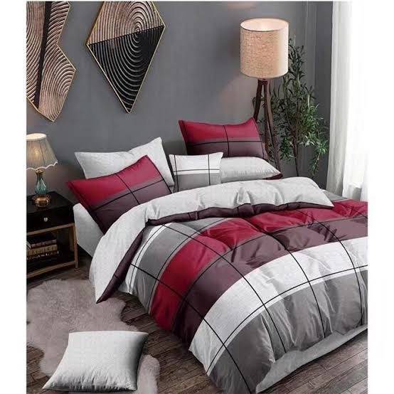

# COMRADES MARKETPACE

## DESCRIPTION

COMRADES MARKETPLACE   is your one-stop destination for all your shopping needs as a comrade because the prices are comrade fairly price. Our website offers a seamless and user-friendly experience for both buyers and sellers. Whether you're looking for brand new products or budget-friendly second-hand items, we've got you covered.It is designed and built in simplicity and realible in mind.

Features:


Home Page: The homepage welcomes you with a clean and intuitive interface, showcasing featured products and the latest deals. It's designed to help you quickly find what you're looking for.

Login Page: Create an account or log in effortlessly to access personalized features, including saved items, order history, and more.

Products: Browse through a wide range of products, including both new and second-hand items. Our extensive catalog covers electronics, fashion, home goods, and much more. Each product listing provides detailed information and high-quality images.

Order Page: Once you've found the perfect item, easily place your order with just a few clicks. You can review your cart, select shipping options, and proceed to checkout.

Payment Page: We offer secure and convenient payment options to ensure a smooth shopping experience. Your payment information is protected, and transactions are processed efficiently.

Reviews Page: Share your feedback and read reviews from other users to make informed decisions. Leave comments and ratings to help fellow shoppers and sellers.

About us page : This indicates the cofounders and the scrum team members with our contact details ,ready for any support incase of need.

## TECHNOLOGIES

The technologies used to create this website were:

1. HTML
2. CSS
3. JAVASCRIPT

## PRE-REQUISITIES

For this application to run you will need:

1. Install `Github` on **Windows**/ use `Linux`.
2. 2GB RAM
3. Google Browser (Chrome, Mozzila, FireFox e.t.c
4. Internet(strong)

## SETUP INSTRUCTIONS
This section will guide you on how you can set up and run this site on your machine.

1. Clone the repository to your local machine. On your computer open the `Terminal` (*Linux/MacOs*)
or `GitBash` (**Windows**)

```
git clone https://github.com/Lancealeyo/ComradeMarketPlace.git
```
2. Change into working directory
```
cd change to working directory
```

3. open in vs code

```
code .
```

## DEMO(SCREENSHOTS)

### Demo
Attached is a working live demo: https://lancealeyo.github.io/ComradesMarketPlace/

### Screenshots
| Beddings | Clothing | Electronics |
|----------|----------|-------------|
||||

## AUTHOR INFO

This website was built by a scrum team of 4 designers with their github username as:

1. Lancealeyo

2. Sharonkatinda

3. Samkhm

4. Amutabitruphena

## KNOWN ISSUES

There are no known issues encountered while building.

## Support and contact details

In case of any issues encountered, ideas or making contributions reach out to:

1. [Lancealeyo](https://github.com/Lancealeyo/ComradesMarketPlace.git)

2. [Sharonkatinda](https://github.com/Sharonkatinda/ComradesMarketPlace.git)

3. [Samkhm](https://github.com/samkhm/comradeMarketPlace.git)

4.  [amutabitruphena](https://github.com/amutbitruphena/comradeMarketPlace)


## LICENSE

This website adheres to terms of MIT license.

Copyright &copy; (2023) (Group 4)


